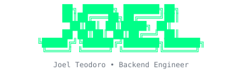

<!-- ══════════════════════════════════════════════════════════════════════════════ -->
<!--  Theme: Terminal Dark  •  Accent: #00ff88  •  Author: Joel Teodoro            -->
<!-- ══════════════════════════════════════════════════════════════════════════════ -->

<div align="center">



**`Backend Engineer`** · **`Spain 🇪🇸`**

<br>

<a href="https://git.io/typing-svg">
  
</a>

<br><br>

<a href="mailto:joel.teodoro.software@gmail.com">
  
</a>
&nbsp;&nbsp;&nbsp;
<a href="https://www.linkedin.com/in/joel-teodoro-gomez/">
  
</a>
&nbsp;&nbsp;&nbsp;
<a href="https://runtimerants.dev/">
  
</a>

</div>

<br>

---

### `$ whoami`

```go
package main

import "fmt"

type Developer struct {
    Name      string
    Role      string
    Location  string
    Languages []string
    Interests []string
}

func (d Developer) String() string {
    return fmt.Sprintf("%s — %s from %s", d.Name, d.Role, d.Location)
}

func (d Developer) CurrentlyLearning() string {
    return "Always something new in distributed systems"
}

func main() {
    me := Developer{
        Name:      "Joel Teodoro",
        Role:      "Backend Engineer",
        Location:  "Spain 🇪🇸",
        Languages: []string{"Go", "Java", "Python", "C"},
        Interests: []string{
            "Scalable microservices",
            "Event-driven architectures",
            "Making things faster",
            "Breaking things to understand them",
        },
    }

    fmt.Println(me)
    // Output: Joel Teodoro — Backend Engineer from Spain 🇪🇸
}
```

---

### `$ cat stack.yml`

```yaml
backend:
  primary:
    - go          # current obsession
    - java        # spring boot ecosystem
  secondary:
    - python      # scripting & automation
    - c           # when i need to go low-level

frameworks:
  - spring-boot   # enterprise stuff
  - gin           # fast & lightweight
  - grpc          # service communication

infrastructure:
  containers: [docker, kubernetes]
  messaging:  [kafka, rabbitmq]
  databases:  [postgresql, redis, mongodb]

practices:
  - clean-architecture
  - domain-driven-design
  - event-sourcing
  - test-driven-development
```

---

### `$ ps aux | grep focus`

```diff
@@ current focus @@

+ Building microservices with Go — obsessed with performance & simplicity
+ Deep diving into Kafka internals — event streaming is beautiful
+ Kubernetes patterns — making deployments boring (in a good way)
+ System design — preparing for scale before it's needed

@@ actively avoiding @@

- Premature optimization (learning to resist)
- Writing code without tests (never again)
```

---

### `$ tree ~/projects --favorites`

<table>
<tr>
<td width="50%">

**`>_` CLI Tools**
> Small tools that solve real problems

Building utilities that automate the boring stuff. If I do something twice, it becomes a script. If I do it three times, it becomes a tool.

</td>
<td width="50%">

**`{ }` Distributed Systems**
> Learning by building

Experimenting with consensus algorithms, event sourcing, and everything that can go wrong in distributed environments (spoiler: everything).

</td>
</tr>
<tr>
<td width="50%">

**`/api` Backend APIs**
> REST, gRPC, GraphQL

Designing APIs that developers actually enjoy using. Documentation included, because past me hates undocumented APIs.

</td>
<td width="50%">

**`./lab` Playground**
> Where ideas go to be tested

Random experiments, proof of concepts, and "what if I try this?" projects. Most fail, some become real tools.

</td>
</tr>
</table>

---

### `$ curl -s api.joel.dev/links`

```json
{
  "email": "joel.teodoro.software@gmail.com",
  "linkedin": "linkedin.com/in/joel-teodoro-gomez",
  "portfolio": "joelteogom.github.io",
  "status": "open to interesting conversations"
}
```

---

### `$ git log --stat`

<p align="center">
  
  
</p>

---

<p align="center">
  
</p>

<p align="center">
  <code>// TODO: write better commit messages</code>
</p>
