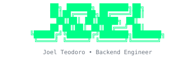

<!-- ══════════════════════════════════════════════════════════════════════════════ -->
<!--  Theme: Terminal Dark  •  Accent: #00ff88  •  Author: Joel Teodoro            -->
<!-- ══════════════════════════════════════════════════════════════════════════════ -->

<div align="center">



**`Go`** · **`Distributed Systems`** · **`Kubernetes`** · **`Database Internals`**

<sub>Backend Engineer · Catalonia, Spain 🇪🇸</sub>

<br>

<a href="https://git.io/typing-svg">
  
</a>

<br><br>

<a href="mailto:joel.teodoro.software@gmail.com">
  
</a>
&nbsp;&nbsp;&nbsp;
<a href="https://www.linkedin.com/in/joel-teodoro-gomez/">
  
</a>
&nbsp;&nbsp;&nbsp;
<a href="https://runtimerants.dev/">
  
</a>

</div>

<br>

---

### `$ uname -a`

```console
joel-teodoro 24.0-go #1 SMP PREEMPT backend distributed-systems x86_64 GNU/Linux
```

I build and run booking platforms: hotels and buses. Payments, cancellations,
refunds, and third-party APIs that document one thing and return another. Go on
Kubernetes, real traffic, real money.

Lately most of my time goes into two things:

**Kubernetes.** I'm preparing the CKA, but the exam is the excuse, not the goal. I want
to know what actually happens between `kubectl apply` and a running pod: the control
plane, reconciliation loops, how kube-proxy turns a ClusterIP into iptables rules.
So I'm building my own small orchestrator to find out, which dragged me straight into
Linux namespaces, netfilter and a lot of networking I thought I already knew.

**Database internals.** Everything eventually ends up on disk, and I want to understand
how. I'm working through *Database Internals* (Petrov) alongside engineering write-ups
like Uber's move from Postgres to MySQL: pages, B+ trees vs LSM trees, WAL, MVCC, and
why two databases that look the same from SQL behave so differently underneath.

Most of what I know came from something breaking first. I write it down at
**[runtimerants.dev](https://runtimerants.dev)** so I don't have to learn it twice.

---

### `$ cat /proc/joel/status`

```yaml
Name:      joel-teodoro
State:     R (running)            # backend in production, every day
Lang:      go                     # everything I ship
Layer:     application → kernel   # currently descending
Focus:     linux · networking · kubernetes · storage engines
Signals:   SIGTERM ignored        # graceful shutdown, obviously
```

---

### `$ lsmod | grep focus`

```console
Module              State       Notes
linux_internals     loaded      namespaces, cgroups: a container is just a process with opinions
netfilter           loaded      iptables, conntrack, DNAT/SNAT: how a ClusterIP actually gets routed
kubernetes          loaded      control plane, reconciliation loops, CNI, kube-proxy · CKA in progress
storage_engines     loading     pages, B+ trees vs LSM, WAL, MVCC: everything ends up on disk
```

---

### `$ kubectl get pods -n lab`

Building the things I use, from scratch, until they stop being magic.

```console
NAME                 READY   STATUS    NOTES
l4-load-balancer     1/1     Running   TCP load balancer in Go, data plane and control plane split
mini-orchestrator    1/1     Running   own control plane + node agent; pods in their own netns,
                                       services wired with iptables DNAT across nodes
```

---

### `$ cat stack.yml`

```yaml
core:
  language:   go
  apis:       [graphql, grpc, rest, websockets]
  data:       [mysql, postgresql, redis, elasticsearch]
  messaging:  [pub/sub, rabbitmq, kafka]

infrastructure:
  orchestration: [kubernetes, docker]
  cloud:         [gcp, cloud-run]
  ci_cd:         [gitlab-ci, github-actions]
  linux:         [namespaces, cgroups, netfilter/iptables]

architecture:
  - hexagonal / ports & adapters
  - domain-driven design
  - event-driven services
  - caching, and the harder half: invalidation

also_shipped:
  - java / spring-boot          # two years of it, same team. I wrote a post about it
  - python, c                   # tooling and systems coursework
```

---

### `$ ls -la ~/archive`

<details>
<summary><b>Earlier builds: Go concurrency and system design, one failure mode per repo</b></summary>

<br>

| Repo | What it does |
| --- | --- |
| [`go-sharded-ws-hub`](https://github.com/JoelTeoGom/go-sharded-ws-hub) | WebSocket fan-out that drops slow clients instead of stalling the broadcast |
| [`go-redis-token-bucket`](https://github.com/JoelTeoGom/go-redis-token-bucket) | One rate limit across N nodes, enforced by an atomic Lua script |
| [`go-priority-scheduler`](https://github.com/JoelTeoGom/go-priority-scheduler) | Min-heap ordering, `sync.Cond` parking, no idle spinning |
| [`CrispLite`](https://github.com/JoelTeoGom/CrispLite) | Chat end to end: WebSockets, Redis Pub/Sub, Postgres, hexagonal |
| [`DDD-Ecommerce`](https://github.com/JoelTeoGom/DDD-Ecommerce) | Bounded contexts and aggregates that enforce their own invariants |
| [`my-http-server`](https://github.com/JoelTeoGom/my-http-server) | HTTP parsed by hand over raw TCP |
| [`go-errgroup-example`](https://github.com/JoelTeoGom/go-errgroup-example) | Parallel fetch, bounded concurrency, first error wins |
| [`go-circuit-breaker-example`](https://github.com/JoelTeoGom/go-circuit-breaker-example) | Full `CLOSED → OPEN → HALF-OPEN` cycle against a failing downstream |
| [`go-fanout-race`](https://github.com/JoelTeoGom/go-fanout-race) | Fan out N requests, keep the fastest, cancel the rest |
| [`SingleFlight-Golang`](https://github.com/JoelTeoGom/SingleFlight-Golang) | Collapsing duplicate in-flight calls so a cache miss isn't a stampede |
| [`Snowflake-generator-service`](https://github.com/JoelTeoGom/Snowflake-generator-service) | 64-bit time-ordered IDs, no coordination |
| [`Data-structures`](https://github.com/JoelTeoGom/Data-structures) | The usual suspects, from scratch, with generics |

</details>

---

### `$ cat ~/reading/now`

```diff
+ Database Internals            Petrov       in progress
+ Designing Data-Intensive Apps Kleppmann    halfway, no rush
+ Concurrency in Go             Cox-Buday    read it twice
```

Everything worth rereading lives in
**[`software-engineering-guide`](https://github.com/JoelTeoGom/software-engineering-guide)**:
articles, papers and books, each with what I actually took from it.

---

### `$ tail -n 5 ~/writing/log`

Deep dives from **[runtimerants.dev](https://runtimerants.dev)**, with the benchmarks
and the source, because "it's faster" isn't an argument:

- **[Write-Ahead Log Internals](https://runtimerants.dev/posts/write-ahead-log-internals)**: what actually happens on INSERT, and how it ends up as CDC
- **[DB Indexes & Transactions](https://runtimerants.dev/posts/database-indexes-transactions-internals)**: B+ trees and row locks are the same story told twice
- **[singleflight Internals](https://runtimerants.dev/posts/go-singleflight-internals)**: one hot key expires, N requests hit the DB
- **[The `context` Package](https://runtimerants.dev/posts/go-context-package-concurrency)**: cancellation across a concurrent call graph
- **[Go vs Spring Boot](https://runtimerants.dev/posts/golang-vs-springboot)**: two years with both, same team, actual numbers

---

### `$ dig +short joel.contact`

```json
{
  "blog":     "https://runtimerants.dev",
  "linkedin": "linkedin.com/in/joel-teodoro-gomez",
  "email":    "joel.teodoro.software@gmail.com",
  "status":   "open to backend / platform / distributed systems roles, remote or Barcelona"
}
```

---

<p align="center">
  
</p>

<p align="center">
  <code>// TODO: write better commit messages</code>
</p>
